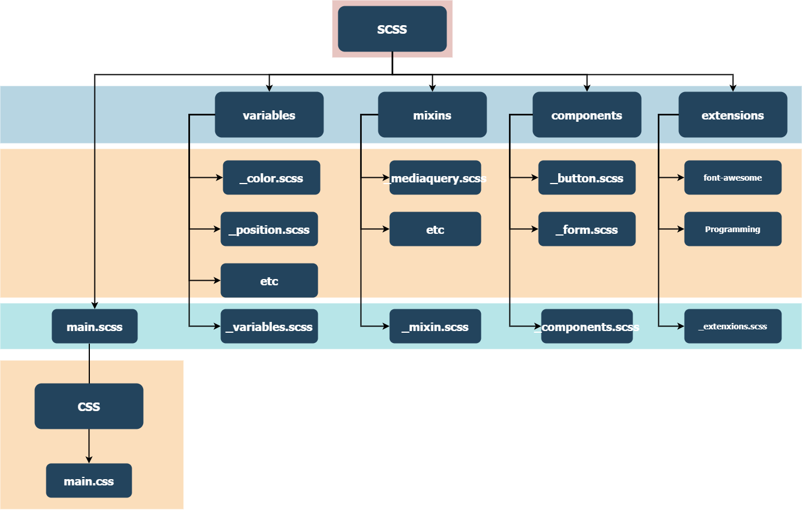
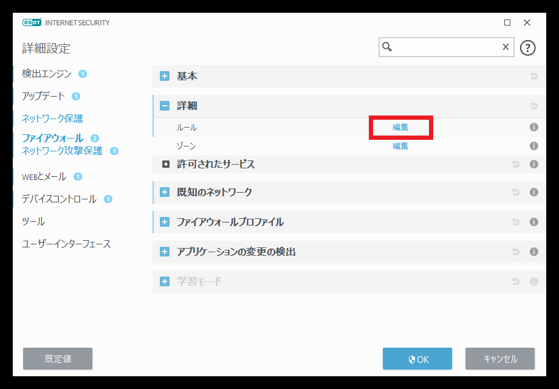

# README

## 開発環境

```
# Windows

Docker Desctop
WSL2
VScode
Windows Terminal

# Mac

Docker Desctop for Mac
Terminal
VScode
```

## 構成図

```
.
├── Tools
│   └── php7.4
│       └── php.exe
├── bootstrap
├── Dockerfile
├── docker-compose.yml
├── mysql
├── package-lock.json
├── wordpress
├── Documents
└── README.md

```
## Dockerのインストール

下記サイトからインストール  
[Docker-Desctop](https://www.docker.com/products/docker-desktop)

<details><summary>Windows向けの設定方法</summary><div>


</div></details>

<details><summary>Mac向けの設定方法</summary><div>


</div></details>

## VSCodeのインストール

extnsionをインストールする。

<details><summary>木下VSCodeインストールExtension例</summary><div>

```bash
anseki.vscode-color
azemoh.one-monokai
christian-kohler.npm-intellisense
codezombiech.gitignore
eg2.vscode-npm-script
felixfbecker.php-intellisense
felixfbecker.php-pack
imperez.smarty
PKief.material-icon-theme
syler.sass-indented
Wscats.eno

eamodio.gitlens
KnisterPeter.vscode-github
GitHub.vscode-pull-request-github
cschleiden.vscode-github-actions
donjayamanne.githistory
mhutchie.git-graph

ms-azuretools.vscode-docker
p1c2u.docker-compose
ms-vscode-remote.remote-containers
ms-vscode-remote.remote-wsl

bmewburn.vscode-intelephense-client
felixfbecker.php-debug
rifi2k.format-html-in-php
neilbrayfield.php-docblocker

MS-CEINTL.vscode-language-pack-ja
alefragnani.project-manager
hediet.vscode-drawio
oderwat.indent-rainbow
Asuka.insertnumbers
formulahendry.auto-rename-tag
mosapride.zenkaku
royaction.color-manager
purocean.drawio-preview

dbaeumer.vscode-eslint
esbenp.prettier-vscode
ritwickdey.live-sass
ritwickdey.LiveServer
thekalinga.bootstrap4-vscode
eventyret.bootstrap-4-cdn-snippet
Zaczero.bootstrap-v4-snippets

```
</div></details>  

## 

### npmでインストール

ワードプレス向けのESlintの設定ファイルを適用させる。

```
npm install -D eslint @wordpress/eslint-plugin
```

設定ファイルの作成

.prettierrc.js

```.prettierrc.js
module.exports = {
  // 基本的にwordpress用のモジュールが設定されているの記載する必要はない
}

```

.eslintrc.js

```.eslintrc.js
module.exports = {
	extends: [ 'plugin:@wordpress/eslint-plugin/recommended' ],
};

```

## ローカル環境のセットアップ

```
# Docker-compose.ymlと同じディレクトリか、その下位ディレクトリで

docker-compsoe up -d --build
```

以上で[localhost:8080/](localhost:8080)にサイトが立ち上がる

### Scssのコンパイルディレクトリの設定

.vscode/settings.jsonを編集する.

```settings.json
{
  "liveSassCompile.settings.formats": [
    {
      "format": "expanded",
      "extensionName": ".css",
      // プロジェクトのcssディレクトリのパスを指定する
      "savePath": "/wordpress/wp-content/themes/ssp-saga/assets/css/"
      // 現在のプロジェクトのテーマファイル内を指定する。
    }
  ],
}
```

## 基本的なSCSSのフォルダ構成

./Documents/scss.drawioを参照


## Tips

### [FireFoxでlocalhostにアクセスできない](https://labor.ewigleere.net/2021/01/29/firefox_restrict_non_well_known_port/)

### [他のPCやスマホ端末でローカル環境を確認したい](https://weback.net/procedure/1752/)

### ローカル環境を社内ネットワークで公開したい時

<details><summary>詳細</summary><div>

#### 事前準備

上記の[他のPCやスマホ端末でローカル環境を確認したい](https://weback.net/procedure/1752/)を行い、ESET等のセキュリティソフトでローカルIPアドレスでのアクセスを許可する設定を行う

#### ルールの作成



「追加」を押して新しいルールを作成する

-  一般設定

```
# 名前
何のルールなのかを名づける

# 方向
# 外向き(ローカル -> リモート)
# 内向き(リモート -> ローカル)
# 双方向
双方向を選択する

# アクション
許可

# プロトコル
TCPおよびUDP
```

- ローカル設定

```
#　ポート
docker-compose.ymlファイルに記載されているポート番号

# IP
192.168.1.0/255.255.255.0
```

#### 参考URL
[https://help.eset.com/ees/7/ja-JP/idh_config_epfw_ids_exceptions.html](https://help.eset.com/ees/7/ja-JP/idh_config_epfw_ids_exceptions.html)
</div></details>

#### ファイルの編集ができない or 保存ができない

権限の問題です。
windowsならwslの実行ユーザー(Ubuntuに登録したユーザー) , MacならTerminalのログインユーザーを「www-data」グループに追加して、新規作成したファイルの権限を775に設定する必要があります。


